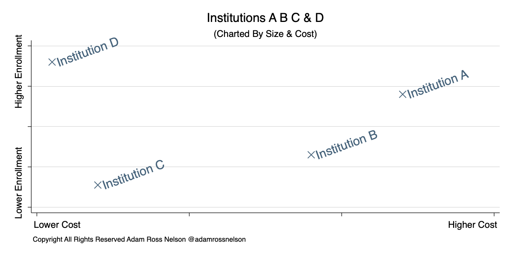
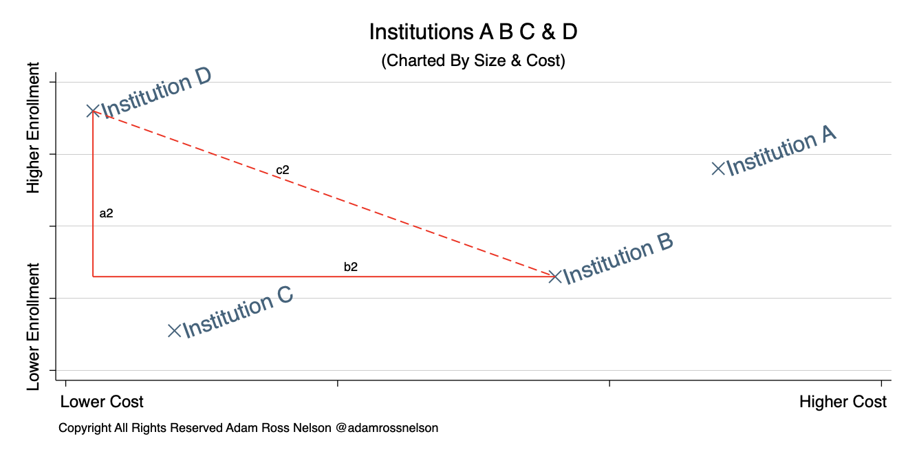
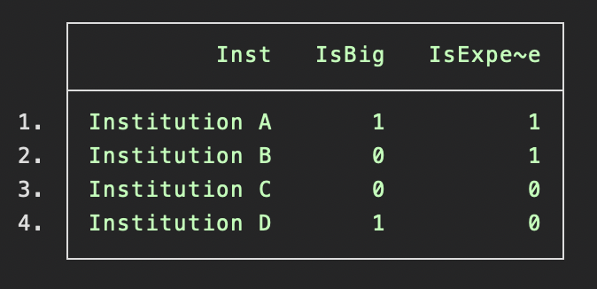
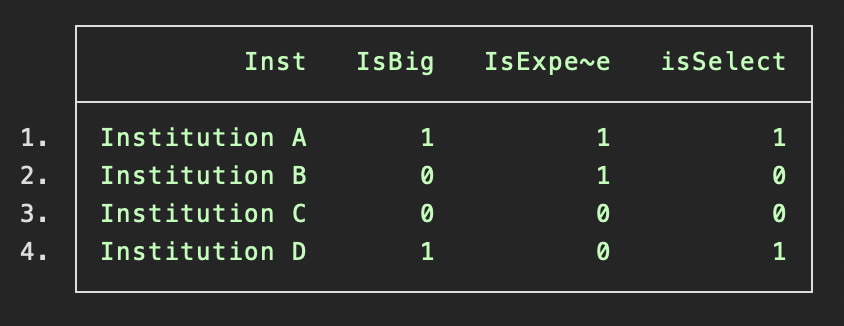
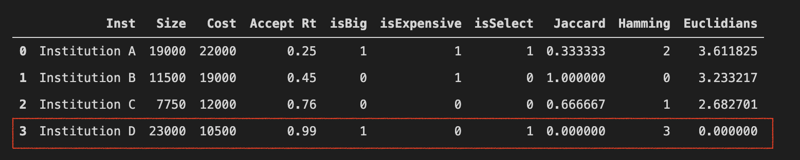

# Comparison Group Overview
This repository hosts support files associated with an article planned for Medium _Towards Data Science_. The general purpose of the article will be to provide a tutorial on how to implement three measures of distance. This tutorial focuses on a specific use case. The use case is building a list of similar comparison units. 

In specific, the tutorial will use data from the US-Department of Education related to higher education institutions. This repository and article will show how distance measures can work as a method to identify similar institutions. By using distance measures to identify similar institutions, researchers and others using higher education data can build comparison groups.

Comparison groups are groups of institutions that are similar. In other contexts, researchers and others often need to find observations that are similar. This tutorial shows how to use distance measures to find similar observations.

# The Use Case & The Intuition
This is a specific use case. Using distance measures to find similar observations is not a novel idea. To see the underlying principle, reference Figure 1 which shows four observations on a scatterplot. Using hypothetical data, Figure one shows the location of four institutions on a scatter plot using the institution’s size (y axis) and the institution’s annual tuition rate (x axis). Figure 1 does not show specific units or scales because for demonstration the units and scales are unnecessary.

**Figure 1**
 

Institution A is both large and costly. Institution B is of moderate size and moderately costly. Institution C is smaller and affordable. While institution D is both large and affordable. 

Imagine you study institution D. Further, imagine you want to select a comparison institution. Which institution would you choose? Finding the literal distance on this chart between institution D and fellow institutions can show which institution is most similar.

The illustration shown in Figure 1 and the accompanying narrative aims to show how this works in two dimensions (x, y). It is also possible to calculate distance in three dimensions (which we can also imagine and visualize). Formal distance measures permit us to find distance in four, five, or more dimensions.

# This Distances
This repository, and the accompanying article shows how to calculate the distance using three distance measures including Euclidian distance, hamming distance, and Jaccard Index index. There are other distance measures. I selected these three because they are easy to implement and easy to interpret.

## Euclidean Distance
At the heart of calculating Euclidean distance is the Pythagorean theorem. The dashed line in Figure 2 shows the distance between institution D and institution B.

**Figure 2**
 

Calculating the length of that distance is as easy as a² + b² = c². When extending this to three dimensions the formula changes to a² + b² + n² = c² where n is the third dimension. 

For multi-dimensional analyses, the convention changes to a² + b² + . . . + n² = c².

## Hamming Distance
An advantage of this method is that it can work well with categorial data (that you will convert to one or more binary arrays). So-called one hot encoding will convert your data to a usable binary array. 

A disadvantage is that you first need to convert continuous to categorial data and then to an array of binaries. These conversions make the measure less interpretable and it requires extensive planning. The planning involves deciding where to put the cut points when converting continuous data to categorical.

The example, given above in Figure 1 & Figure 2, involving enrollment size and cost would convert to data similar to the data shown in Figure 3.

**Figure 3**
 

Then Hamming distance works by calculating the number of values that match, the higher the count the closer the observations. 

The distance between Institution D and institution C is 1. The distance between institution D & institution B is 0. Then the distance between institution D & institution A is also 1. Thus, with this two-dimensional example, the results are inconclusive.

With more dimensions, where the term dimensions are synonymous with ‘points of comparison’ the results would likely be more conclusive. For example, say we added a dimension called isSelect where schools that accept less than half of their applicants are selective while schools that accept more than half of their applicants are not selective. I show this added dimension in Figure 4. 

**Figure 4**
 

Given the added selectivity dimension, the distances change. For D to C we get 1 (same as above), for D to B we get 0 (same as above), but for D to A we get 2. Adding the selectivity data point better differentiates the institutional comparisons.

## Jaccard Index
The Jaccard index also works best with categorial data, or otherwise with continuous data that you have transformed to categorical. The Jaccard index calculates distance by putting the number of matching dimensions over the total number of dimensions and then subtracting that result from 1. Note that counting the number of matches is also the Hamming distance.

Using Figure 4 the distances for D to C would be .66, for D to B it would be 1, and for D to A it would be .33. Thus the Jaccard index shows that institution D is most similar to institution A.

# Conclusion
The final figure, Figure 5 shows a final set of results. Figure 5 includes a column called Accept Rt which corresponds to isSelect, as described above. Shown in Figure 5 are the distances for all observations from the reference observation, observation 3 (institution D - boxed in red).

**Figure 5**
 

From these results, we see that the various methods do not always agree. The Jaccard and Hamming methods agree that institution A is most similar (most alike) to institution D. While Euclidian distance indicates that Institution C is most similar (most alike) to institution D.

Notice also, that for a Jaccard Index and Euclidian distance, smaller results indicate closer proximity. For hamming distance, larger results indicate cloer proximity.

To make a comparison group among dozens or hundreds of institutions, as this repository's companion article will show, these methods can calculate distance. Then, by sorting on that distance, the X number of closest institutions may work as a plausible comparison group.

# References
Grootendorst, M. (2021) 9 Distance Measures In Data Science. Towards Data Science. Medium. (Online).